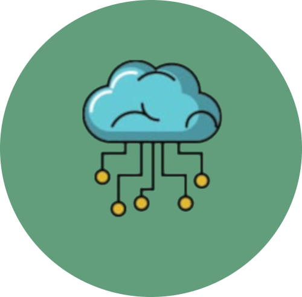

# FL Automations Portfolio

A modern, interactive portfolio website showcasing projects and skills with a responsive design and bilingual support.



## Features

- **Interactive Coin Flip**: Engaging profile image that flips to reveal different tech stack icons
- **Responsive Design**: Fully responsive layout optimized for all devices
- **Bilingual Support**: Toggle between English and Spanish content
- **Dark/Light Mode**: User-selectable color scheme
- **Project Showcase**: Featured projects section with filtering capabilities
- **Form Validation**: Contact form with client-side validation and feedback
- **Dynamic Content**: Projects loaded from JSON with fallback data
- **Animations**: Smooth animations and transitions using AOS library

## Technologies Used

- HTML5
- CSS3
- JavaScript (ES6+)
- [TailwindCSS](https://tailwindcss.com/)
- [AOS](https://michalsnik.github.io/aos/) - Animate On Scroll library
- [Typed.js](https://github.com/mattboldt/typed.js/) - Typing animation
- [Font Awesome](https://fontawesome.com/) - Icons

## Project Structure

```
├── css/
│   ├── style.css
│   └── contact.css
├── img/
│   ├── Projects/
│   └── ...
├── js/
│   ├── main.js
│   └── projects.json
├── index.html
└── README.md
```

## Installation & Setup

1. Clone the repository:
   ```bash
   git clone https://github.com/YourUsername/flucena.git
   cd flucena
   ```

2. Open `index.html` in your browser or use a local server:
   ```bash
   # Using Python
   python -m http.server
   
   # Or using Node.js
   npx serve
   ```

## Usage

- **Coin Flip**: Click or drag the profile image to see it flip and reveal tech icons
- **Language Toggle**: Click the language icon in the navigation to switch between English and Spanish
- **Dark/Light Mode**: Click the moon icon to toggle between dark and light themes
- **Project Filter**: Use the "View all projects" link to see all projects with filtering options
- **Contact Form**: Fill out the form at the bottom to send a message

## Project Highlights

The portfolio showcases various projects including:
- Web applications
- Automations
- React/Next.js projects
- Python applications
- And more!

## Contributing

Contributions are welcome! Feel free to submit a pull request or open an issue.

1. Fork the repository
2. Create your feature branch (`git checkout -b feature/amazing-feature`)
3. Commit your changes (`git commit -m 'Add some amazing feature'`)
4. Push to the branch (`git push origin feature/amazing-feature`)
5. Open a Pull Request

## Contact

Francisco Lucena - [flucena.dev@gmail.com](mailto:flucena.dev@gmail.com)

Project Link: [https://www.flautomations.com.ar/](https://www.flautomations.com.ar/)

## License

This project is licensed under the MIT License - see the LICENSE file for details.
